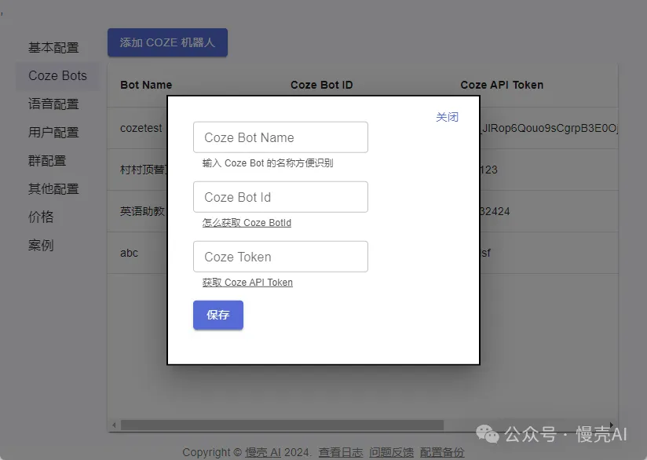

## 发布机器人

登录 [Coze 平台](https://www.coze.cn/)，创建机器人，并将机器人发布为 API

参考内容：

1. [创建第一个机器人](https://www.coze.cn/docs/guides/quickstart)
2. [发布机器人为 API](https://www.coze.cn/docs/developer_guides/preparation)

在创建机器人的时候，在 Bot 详情页的浏览器地址栏上，bot/后面的字符串是 BotID，请记录下它，第四步会用到。参考：[怎么获得 Coze BotID](https://mp.weixin.qq.com/s?__biz=Mzg5OTg5NTgwMg==&mid=2247483724&idx=1&sn=c1cda9477c3161a9e499cfda01c80210&chksm=c04d19d9f73a90cf269dec2eae8c78ed8ea0dd2104d3190ef2d12c5cf365c1543a1d14fc0525&token=2135729166&lang=zh_CN#rd)

在 [Token 管理页面](https://www.coze.cn/open/api)创建一个 Coze Token，第四步也会用到

## 第四步：配置机器人 ID 和 Coze API token

打开 慢壳 AI 软件，切到 ‘Coze Bots’ 菜单项，点击添加 Coze 机器人，在表单中录入上述 BotID, Token

Name 您随意填写

