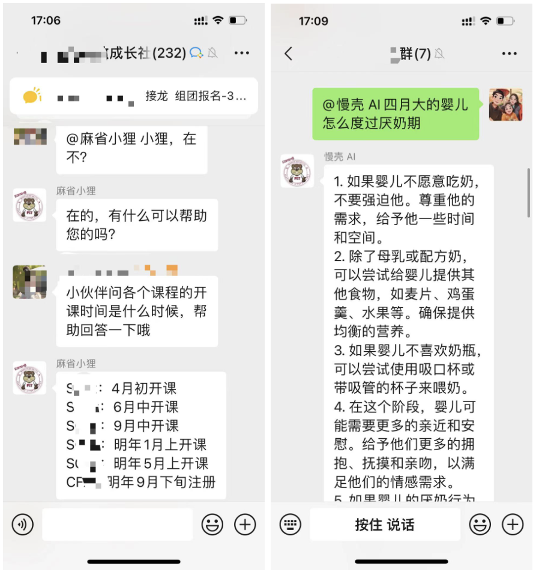
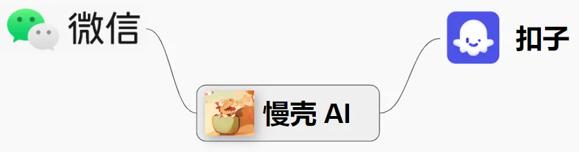

# ChatGPT 怎么接入微信

很多人都希望将 ChatGPT 接入微信，其实核心需求是将 AI 接入微信，今天的国产大模型能力也很强了，尤其是 Kimi，文字处理能力不比 ChatGPT 差，我已经很久没用我的 ChatGPT API 了。

并且依托 Coze 这样的机器人平台，我们可以创建更加可控更强大的机器人，包括自定义工作流、集成数据库、插件、图片流等，底层的大模型也支持主流国产大模型，如 Kimi、GLM、豆包、通义千问、百川等。
所以，如果你想将 AI（类似 ChatGPT）接入到微信，可以在 Coze 创建机器人，将机器人发布到微信。

但官方是不支持发布到个人微信的，也就是说你无法在私聊和群聊中使用你的机器人，只能通过公众号、小程序、网页等方式使用。

而慢壳 AI 软件就是为你实现这个功能的，安装软件一键绑定微信，即可在微信中使用你的机器人。不需要你懂技术，更不需要你有 Github 账号和 Docker 等。

## 功能预览（类似 ChatGPT 的微信聊天机器人）

绑定后，微信与AI聊天的界面效果如下：

## 软件介绍

慢壳 AI 软件是一款运行在 Windows 系统上的桌面软件，使用它**将你的微信变成一个 AI 机器人**，通俗地说，别人跟你聊天就好像跟 ChatGPT 聊天一样。

慢壳 AI 软件起桥梁作用，一头连着微信，另一头连接 AI 机器人。而这个 AI 机器人是由 Coze 平台提供，通过 [Coze 机器人平台](https://www.coze.cn/)，您可以创建基于国内主流大模型的 AI 机器人。该平台支持的大模型功能与 ChatGPT 一样，包含 Kimi、豆包、百川、通义千问、GLM 等。

## 使用教程

第一步：下载并安装软件。加我的微信获取软件安装包，只支持 Windows。微信二维码见文章末尾

第二步：管理员身份运行并登录微信

第三步：管理员身份运行软件，绑定微信，

第四步：设置要应答的好友和群

第五步：到 Coze官网创建 Coze Bot，获取 Coze API Token。回到软件设置 Coze API Token 和 Bot Id，界面截图同上

最后一步：向你的微信发送消息，AI 将自动回答。

## 视频教程

[视频教程](https://mp.weixin.qq.com/s/sW94t8ISJ786rPXAhf5aVA)

## 常见问题

Q1: 公众号也看过关于微信接入ChatGPT的文章，和这款软件有什么区别

回答：两个原因：

1. 零技术门槛。例如这篇 教大家如何将ChatGPT 接入微信，对于不懂技术的朋友有比较高的门槛，里面提到需要Docker、Github、服务器等，我这款软件跟安装个其他普通软件是一样的，不需要你会技术
2. 稳定不掉线。同样是这篇 教大家如何将ChatGPT 接入微信，该方法登录微信经常掉线

Q2: 使用这个软件有泄密的风险吗？
回答：微信客户端是官方的，登录和聊天消息也是在你本机电脑上，不会泄露你的聊天记录，不违规使用也不会被封号，如你不放心，可以使用小号。

Q3: Coze 官方不支持发布到微信吗？
回答：是的，Coze可以发送企业微信，订阅号，服务号，但不支持微信私聊和群聊

Q4: Coze 是什么，能用来干嘛
回答：扣子字节跳动旗下 AI Bot 开发平台，只要你有想法，都可以用扣子快速、低门槛搭建专属于你的 AI 机器人。
平台有知识库、插件、Workflow、数据库、图片流等能力，可以让 AI Bot具备丰富的能力，例如可以实现阅读网页、PDF、翻译、任务规划、收集表单等等
同时 Coze AI 机器人可以配置 KIMI AI 大模型。

## 微信二维码

## 官方网站

[慢壳 AI 官网](https://weai.chat/)
