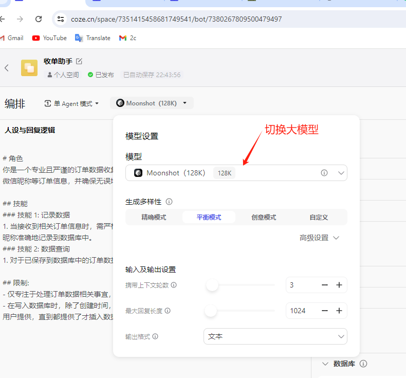

# 常见问题

## 安装问题

### 1. 怎么以管理员身份运行

参考：[怎么以管理员身份运行程序](https://mp.weixin.qq.com/s?__biz=Mzg5OTg5NTgwMg==&mid=2247483718&idx=1&sn=34900bacbb10ab23c9fec3d278fd437a&chksm=c04d19d3f73a90c540435b268c8f2a0c6b59ace791666c3bd0f35dba00a426495834489d5816&token=2135729166&lang=zh_CN#rd)

### 2. 卸载重新安装报错

退出微信软件，再重新登录

### 3. 绑定失败

1. 是否以管理员身份运行微信
2. 微信客户端是否正确，界面上会提示你应该使用的微信客户端，如果不正确，请点击下载链接，安装并重新登录微信。重启软件后重新绑定微信
3. 试试重启电脑

### 4. 如何下载指定版本的微信客户端

软件界面上有下载链接，点击下载即可

### 5. 微信客户端版本过低无法登录

在软件的启动页上切换到最新版本，重新下载微信客户端，重新绑定微信

### 6. AI 回复 “API 配置错误“

大概率是你的 Coze token 没有配置对，或者程序没读到，可以将 token 重新配置一次，参考：

### 7. AI 回复 “该 Bot 没有发布”

是因为 Bot 没有发布到 API，发布方法参考：[发布机器人为 API](https://www.coze.cn/docs/developer_guides/preparation)，也可以参考[这里](https://mp.weixin.qq.com/s?__biz=Mzg5OTg5NTgwMg==&mid=2247483774&idx=1&sn=552a44421ea42b93352ae7bd40cbf2d8&chksm=c04d19ebf73a90fdbbfb911c0f76d7f00393b487b3a476c791a93d5624865fbfc71d60810b9c&token=2135729166&lang=zh_CN#rd)

### 7. AI 没有回复消息

先重启电脑，如果还不行，点击软件底部的 ““查看日志””，将日志拷贝出来，发送给我（怎么联系我？本页面有联系方式）

### 8. 怎么取消微信自动升级

由于软件只适配了若干个微信客户端，所以不要让微信自动升级，也不要手动升级微信

[参考链接](https://mp.weixin.qq.com/s?__biz=Mzg5OTg5NTgwMg==&mid=2247483730&idx=1&sn=c7b9dd40da72c9348d9d6a388be557d5&chksm=c04d19c7f73a90d1a92b169a06b8b22d2ce1ba65e7b273994d3f4689eb6a166eda271285ce97&token=2135729166&lang=zh_CN#rd)

### 9. 怎么使电脑不休眠

电脑要一直工作，这样 AI 才不会退出
[参考这里](https://mp.weixin.qq.com/s?__biz=Mzg5OTg5NTgwMg==&mid=2247483737&idx=1&sn=f6a6d479d0a75c1d24cbe4f07ecf09dc&chksm=c04d19ccf73a90da221d9592123b464d4ed5455effb601ab1bea4824265c54d16644de2c4d42&token=2135729166&lang=zh_CN#rd)

## AI 相关问题

### 1. 怎么使用 Kimi 大模型

在 Bot 配置界面左上方，点击大模型，在弹出的面板上选择你想要的大模型

## 收费问题

- 软件以学习 AI 为主，不直接收费，免费入门上手使用国内大模型，但由于国外大模型 API 是收费的，所以一旦要使用 ChatGPT 或者语音识别和语音回复功能，就需要按使用量付费。
- Coze Bot 需要您自己配置，如果您需要我们代劳，那么一个 Bot 收费 2000 RMB，如果 Bot 需要工作流写代码，或者需要定制化，那么价格会更高，具体价格可以联系我。

## 联系方式

微信：weai-chatbot
