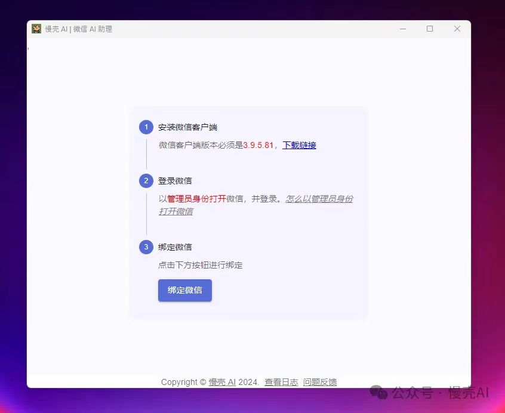
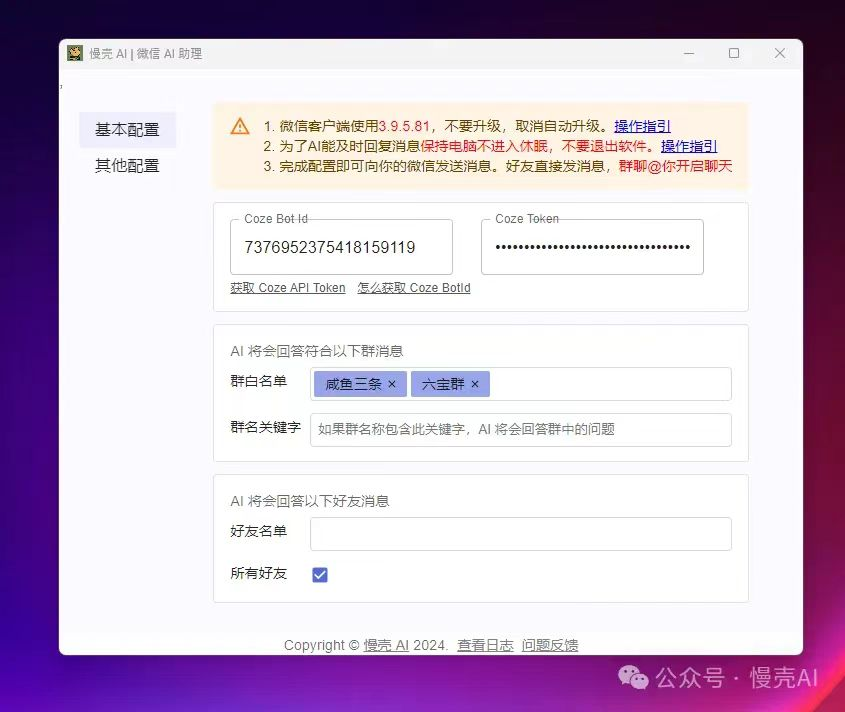
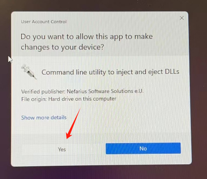

# 快速开始

慢壳 AI 软件是一款运行在 Windows 系统上的桌面软件，使用它 _将你的微信变成一个 AI 机器人_，通俗地说，别人跟你聊天就好像跟 ChatGPT 聊天一样。

软件的使用非常简单，只需要 4 个步骤操作即可：

1. 下载并安装慢壳 AI 软件
2. 登录微信
3. 创建机器人
4. 配置机器人 ID 和 Coze API token

## 第一步：下载并安装慢壳 AI 软件

添加微信获取软件下载链接：

使用 Windows PC 电脑安装慢壳 AI 软件后，打开软件，界面上有使用的步骤指引，按*指引下载并安装相应的微信客户端版本*

## 第二步：绑定微信

安装好微信客户端后，_使用管理员身份运行微信_，正常登录微信即可。完成后回到慢壳 AI 软件点击 “绑定微信” 按钮（如下图 1），在弹出的窗口中点击确定（如下图 2），即可绑定成功

图 1

图 2

注：[怎么以管理员身份运行程序](https://mp.weixin.qq.com/s?__biz=Mzg5OTg5NTgwMg==&mid=2247483718&idx=1&sn=34900bacbb10ab23c9fec3d278fd437a&chksm=c04d19d3f73a90c540435b268c8f2a0c6b59ace791666c3bd0f35dba00a426495834489d5816&token=2135729166&lang=zh_CN#rd)

## 第三步：创建机器人

登录 [Coze 平台](https://www.coze.cn/)，创建机器人，并将机器人发布为 API

参考内容：

1. [创建第一个机器人](https://www.coze.cn/docs/guides/quickstart)
2. [发布机器人为 API](https://www.coze.cn/docs/developer_guides/preparation)

在创建机器人的时候，在 Bot 详情页的浏览器地址栏上，bot/后面的字符串是 BotID，请记录下它，第四步会用到。参考：[怎么获得 Coze BotID](https://mp.weixin.qq.com/s?__biz=Mzg5OTg5NTgwMg==&mid=2247483724&idx=1&sn=c1cda9477c3161a9e499cfda01c80210&chksm=c04d19d9f73a90cf269dec2eae8c78ed8ea0dd2104d3190ef2d12c5cf365c1543a1d14fc0525&token=2135729166&lang=zh_CN#rd)

在 [Token 管理页面](https://www.coze.cn/open/api)创建一个 Coze Token，第四步也会用到

## 第四步：配置机器人 ID 和 Coze API token

回到慢壳 AI 软件界面，有两个配置：

1. 输入 Coze Bot Id 和 Coze token（详见第三步说明）
2. 输入希望回答的群和好友

_恭喜！！完成以上所有步骤，你就可以让好友发送消息给你，看看 TA 是不是感觉跟 ChatGPT 对上话了。而群中激活 AI 的方法则是群中任意一人@你_

遇到问题参考：[FAQ](./faq)
