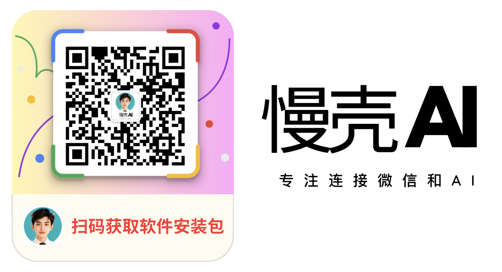

# 快速开始

慢壳 AI 软件是一款运行在 Windows 系统上的桌面软件，使用它 _将你的微信变成一个 AI 机器人_，通俗地说，别人跟你聊天就好像跟 ChatGPT 聊天一样。

软件的使用非常简单，只需要 4 个步骤操作即可：

1. 下载并安装慢壳 AI 软件
2. 登录微信
3. 创建机器人
4. 配置机器人 ID 和 Coze API token

## 下载并安装慢壳 AI 软件

添加微信获取软件下载链接：

使用 Windows PC 电脑安装慢壳 AI 软件后，打开软件，界面上有使用的步骤指引，按*指引下载并安装相应的微信客户端版本*

## 登录微信

安装好微信客户端后，_使用管理员身份运行微信_，正常登录微信即可。完成后回到慢壳 AI 软件点击 “绑定微信” 按钮，在弹出的窗口中点击确定（如下图所示），即可绑定成功

## 创建机器人

登录 Coze 平台，创建机器人，并将机器人发布为 API

参考内容：

1. [创建机器人](https://www.coze.cn/docs/guides/quickstart)
2. [发布机器人为 API](https://www.coze.cn/docs/developer_guides/preparation)

## 配置机器人 ID 和 Coze API token

回到慢壳 AI 软件界面，有两个配置：

1. 输入 Coze Bot Id 和 Coze token
2. 输入希望回答的群和好友

_恭喜！！完成以上所有步骤，你就可以让好友发送消息给你，看看 TA 是不是感觉跟 ChatGPT 对上话了。而群中激活 AI 的方法则是群中任意一人@你_
