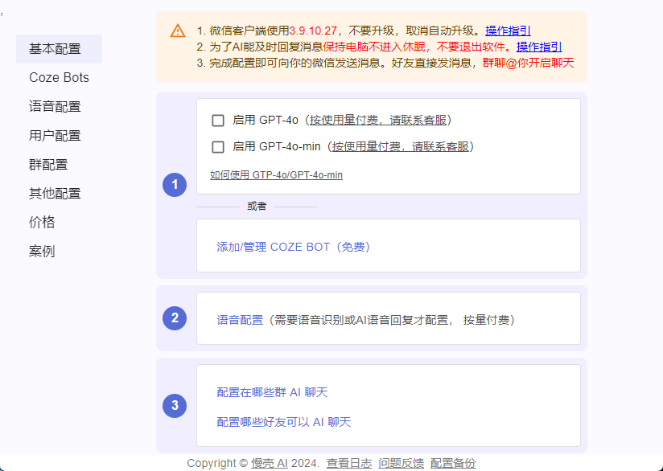

# 快速开始

慢壳 AI 软件是一款运行在 Windows 系统上的桌面软件，使用它 _将你的微信变成一个 AI 机器人_，通俗地说，别人跟你聊天就好像跟 ChatGPT 聊天一样。

软件的使用非常简单，只需要 4 个步骤操作即可：

1. 下载并安装软件
2. 登录微信
3. 配置机器人
4. 测试 AI 是否生效

## 第一步：下载并安装慢壳 AI 软件

- 系统要求：Windows（最好是 Win11）
- 安装指定版本的微信客户端（3.9.10.27）
- 安装慢壳 AI 软件

添加微信获取软件下载链接：

也可以自助下载：

- 慢壳 AI 软件: https://pan.baidu.com/s/1tNSghE_O3MeGP1dYGz7nAg?pwd=4cuu
- 微信客户端(WeChatSetup-3.9.10.27.exe): https://pan.baidu.com/s/1UY-8BIsyBoW3irHGOYRDyw?pwd=a394

## 第二步：绑定微信

- 第一步：启动并登录微信
- 第二步：打开慢壳 AI 软件
- 第三步：点击慢壳 AI 软件上的“绑定”按钮

安装好微信客户端后，正常登录微信即可。完成后打开慢壳 AI 软件点击 “绑定微信” 按钮

## 第三步：创建机器人

配置也是分三步

- 第一步：配置 AI 模型，可选择 ChatGPT 或 Coze Bot，前者按 Token 使用量收费，**后者免费免费**
- 第二步：微信语音配置，这项不是必须的，取决于您是否需要识别微信语音，以及 AI 语音回复，语音也是按使用量付费
- 第三步：配置在哪些群聊或私聊上激活 AI

以上配置中，咸鱼三条这个群使用了 Coze AI 机器人。在使用 Coze 机器人之前您需要先添加 Coze Bot，具体参考如何添加 Coze 机器人参考：[如何添加 Coze 机器人](./add_cozebot)

## 第四步：测试 AI 是否生效

完成配置后，向已经激活的群聊或者私聊发消息，例如根据本文的配置，使用微信在“咸鱼三条”的群内艾特我，AI 就会回复，如下图

_恭喜！！完成以上所有步骤，你就可以让好友发送消息给你，看看 TA 是不是感觉跟 ChatGPT 对上话了。而群中激活 AI 的方法则是群中任意一人@你_

遇到问题参考：[FAQ](./faq)

应用案例：[案例](./use_cases)
