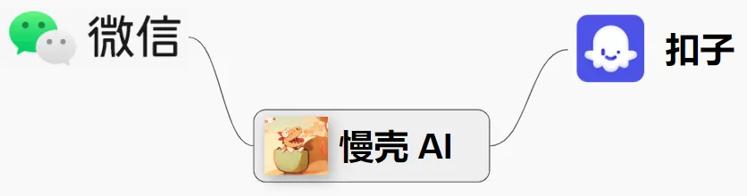
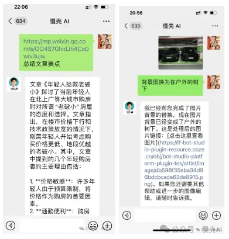
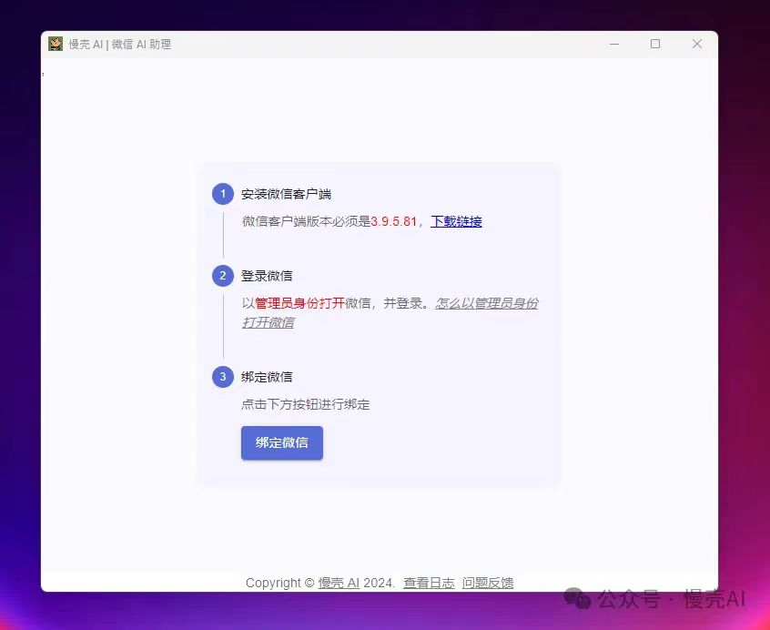
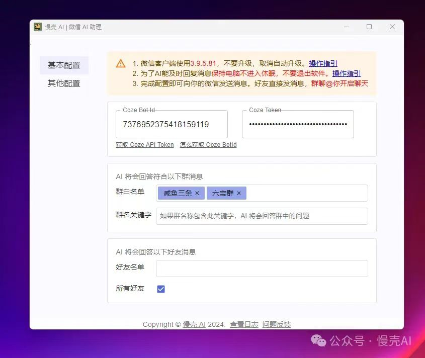

# 什么是慢壳 AI 软件

欢迎使用慢壳 AI 软件，此文档介绍慢壳 AI 软件的基本功能。

## 一、核心功能

慢壳 AI 软件是一款运行在 Windows 系统上的桌面软件，使用它*将你的微信变成一个 AI 机器人*，通俗地说，别人跟你聊天就好像跟 ChatGPT 聊天一样。

慢壳 AI 软件起桥梁作用，一头连着微信，另一头连接 AI 机器人。而这个 AI 机器人是由 Coze 平台提供，通过 Coze 机器人平台，您可以创建基于国内主流大模型的 AI 机器人。该平台支持的大模型功能与 ChatGPT 一样，包含 Kimi、豆包、百川、通义千问、GLM 等。

## 二、功能预览

绑定后，微信与 AI 聊天的界面效果如下，由于使用软件绑定了微信和 AI，好友跟我聊天就好像跟 ChatGPT 聊天：

打开网页还有[视频介绍](https://mp.weixin.qq.com/s?__biz=Mzg5OTg5NTgwMg==&mid=2247483759&idx=1&sn=9cc1959e8ba4f77043bc2d3411e093fc&chksm=c04d19faf73a90ec8712dac72b84d9e2b823b7775760a3eacbae3dbf7b7eef2e859310a9575c&token=2135729166&lang=zh_CN#rd)

## 二、优势

### 🤡🤡🤡 全网最简单，一键将类似 ChatGPT 的大模型接入微信

- 🤡 只需要三步：下载并安装软件、配置群和好友、配置 Coze API Key 和 Bot ID
- 🔥 零技术门槛、不需要您有 Github、不需要您会 Docker

做为对比，您可以参考一下 [ChatGPT on wechat](https://mp.weixin.qq.com/s?__biz=MzU5MjYwNzA1Mw==&mid=2247485304&idx=1&sn=fb9228b648e6e3c9b8d6c92161ba0852&scene=21#wechat_redirect) 的部署门槛有多高

### 🚀🚀🚀 机器人稳定不掉线

🎃👻 其他基于网页微信的程序（例如[ChatGPT on wechat](https://mp.weixin.qq.com/s?__biz=MzU5MjYwNzA1Mw==&mid=2247485304&idx=1&sn=fb9228b648e6e3c9b8d6c92161ba0852&scene=21#wechat_redirect) ），容易掉线甚至被封号，慢壳 AI 软件基于 PC 客户端，_稳定不掉线_。
🚀🚀🚀 注：在不滥用发送违规信息的情况下，慢壳 AI 软件不会导致您的微信被封，但由于微信风控规则并非公开，所以无法 100% 保证不被封号，就像个人正常使用微信也有可能被封号一样。

### 🤖️ 支持国内主流大模型，效果并不比 ChatGPT 差

- 🤖️ 支持 Kimi、豆包、百川、通义千问、GLM 等国内主流大模型

### 连接 Coze 智能体，无需科学上网即可触达主流类似 ChatGPT 的大模型

Coze 是抖音字节旗下的机器人平台。无需编程即可创建功能强大的机器人，能当智能客服、编辑图片、文档解读、规划旅游行程、回答各种问题。
底层支持多种类似 ChatGPT 的大模型，支持 Kimi，豆包，义通千问、GLM 等。无需编程，无需技术。
